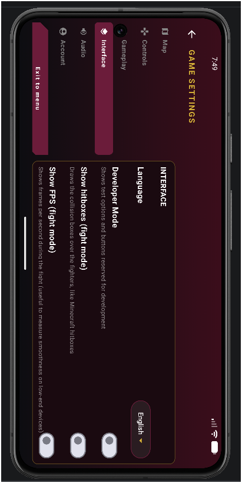
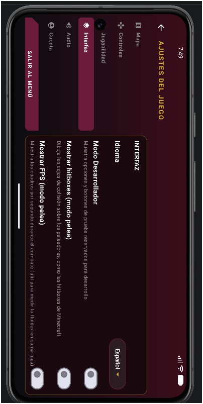

# First Partial Exam - Pull Request with QA

## General information

**Student:** Mayra Solis Lugo  
**GitHub:** MXYSL  
**Project:** PolitecnicoOpenWorld  
**Implementation branch:** `fix/game-feedback-and-exit-flow`  
**Academic delivery branch:** `exam1-delivery`

## Objective

Prepare, test, document, and submit a small Android contribution to PolitecnicoOpenWorld through a Pull Request with reproducible QA evidence.

## Contribution scope

This contribution contains two focused interaction improvements:

1. Clarify the Settings exit action by replacing the generic `BACK / VOLVER` label with `EXIT TO MENU / SALIR AL MENÚ`.
2. Add sound feedback when selecting a character before starting a new Story Mode game.

Out of scope: Story Mode save logic, character movement, new audio assets, navigation redesign, and multiplayer changes.

## Issue

[MXYSL/PolitecnicoOpenWorld#2](https://github.com/MXYSL/PolitecnicoOpenWorld/issues/2)

## Pull Request

[gabrielhuav/PolitecnicoOpenWorld#177](https://github.com/gabrielhuav/PolitecnicoOpenWorld/pull/177)

## Before / After

### Change 1 - Settings exit action

| Before | After - English | After - Spanish |
| --- | --- | --- |
| The bottom action displayed `BACK` / `VOLVER`, even though it exits to the Main Menu. |  |  |

The navigation behavior was preserved. The label now describes the action performed by the control.

### Change 2 - Character-selection feedback

| Before | After |
| --- | --- |
| Selecting a character continued to the save-slot screen without a dedicated confirmation sound. | [TC-05 - Character selection with sound](evidencias/TC05_character_sound.mp4) |

The implementation reuses the existing item sound through `SoundManager`; no new audio asset was added.

Limit-condition evidence:

[TC-06 - Character selection with SFX = 0](evidencias/TC06_sfx_zero.mp4)

## Navigation evidence

- [TC-03 - Top Back returns to Free Roam](evidencias/TC03_back_to_free_roam.webm)
- [TC-04 - Exit to Menu from Free Roam](evidencias/TC04_exit_free_roam.mp4)

## Versions

**Base SHA:**  
`7ed325393f82872c2be94ff2ada46948efa19152`

**Tested implementation SHA:**  
`f808274d6cf4c2d872a92f474db79abaab68811a`

The academic-delivery branch contains documentation/evidence commits after the tested implementation SHA. Those commits do not modify application behavior.

## Implementation commits

- `a825da84` - `fix: clarify settings exit action`
- `f808274d` - `feat: add sound feedback to character selection`

## QA

[Open the full QA matrix and test results](docs/pruebas.md)

Six manual test cases were retained, covering:

- Happy path
- Limit condition
- Regression
- Navigation and state
- Compatibility / environment through language configuration

A dedicated large-font / TalkBack accessibility scenario is listed as a remaining limitation and is not claimed as verified.

## Test environment

- Windows 11
- Android Studio Quail 4 | 2026.1.4
- Android Studio build: AI-261.26222.65.2614.16204760
- Android Studio Runtime: OpenJDK 25.0.3
- Local Gradle JDK: Amazon Corretto 25.0.4.1
- Gradle 9.5.0
- Pixel 8 AVD
- Android 17
- API 37
- x86_64

## Local automated verification

Command executed from the internal `PolitecnicoOpenWorld` Gradle project:

```powershell
.\gradlew.bat :app:assembleDebug :app:testDebugUnitTest :shared:testAndroidHostTest --stacktrace
```

Result:

```text
BUILD SUCCESSFUL in 21s
79 actionable tasks: 10 executed, 69 up-to-date
```

## CI / Checks

PR Quality Gate: [PR #177 Checks](https://github.com/gabrielhuav/PolitecnicoOpenWorld/pull/177/checks)

For tested implementation SHA `f808274d6cf4c2d872a92f474db79abaab68811a`, GitHub registered PR Quality Gate run **#179**. The run is reported as **action_required** and contains no executed jobs, so it is documented as an external CI/authorization condition rather than as a passing CI result.

Local Gradle verification completed successfully as documented above.

## Technical review

Peer review is recorded in the Pull Request conversation/review once a reviewer reproduces at least one identified QA case.

## Conclusion

The two interaction changes were tested on the documented Android environment. The executed scenarios confirm that the Settings exit label now communicates the actual navigation behavior and that character selection provides sound feedback without making the selection flow dependent on audible SFX.

No blocking regression was observed in the executed cases.

## AI tool disclosure

ChatGPT was used to support:

- interpretation of the exam requirements;
- QA-plan structure;
- acceptance-criteria and risk organization;
- Git/GitHub workflow guidance;
- technical-documentation drafting.

Implementation execution, test execution, observations, and evidence capture were performed and verified by the student.
