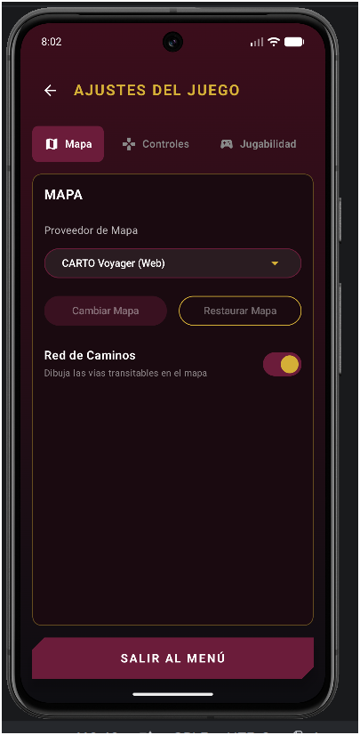

# First Partial Exam - Pull Request with Quality Assurance

## General Information

**Student:** Mayra Solis Lugo  
**GitHub user:** `MXYSL`  
**Course group:** `7CV4`  
**Project:** PolitecnicoOpenWorld  
**Original repository:** [gabrielhuav/PolitecnicoOpenWorld](https://github.com/gabrielhuav/PolitecnicoOpenWorld)  
**Implementation branch:** `fix/game-feedback-and-exit-flow`  
**Academic delivery branch:** `exam1-delivery`  
**Date:** October 1, 2026  

---

## Objective

The objective of this contribution is to prepare, implement, test, document, and submit a small Android improvement to **PolitecnicoOpenWorld** through a Pull Request supported by reproducible Quality Assurance evidence.

The contribution focuses on two user-interaction improvements:

1. Clarifying the behavior of the Settings exit button.
2. Adding audible feedback when selecting a character before starting a new Story Mode game.

---

## Issue

**Issue #2 - Improve settings exit clarity and character selection feedback**

https://github.com/MXYSL/PolitecnicoOpenWorld/issues/2

---

## Pull Request

**Pull Request #177 - Improve settings exit clarity and character selection feedback**

https://github.com/gabrielhuav/PolitecnicoOpenWorld/pull/177

**Base repository:** `gabrielhuav/PolitecnicoOpenWorld`  
**Base branch:** `main`  
**Head repository:** `MXYSL/PolitecnicoOpenWorld`  
**Head branch:** `fix/game-feedback-and-exit-flow`

---

# Contribution Scope

The contribution contains two focused improvements.

### Change 1 - Settings Exit Action

The bottom button in the Settings screen previously displayed:

- `BACK` in English.
- `VOLVER` in Spanish.

However, the control does not simply return to the previous screen. Its actual behavior is to leave the current flow and navigate to the Main Menu.

The label was changed to:

- `EXIT TO MENU` in English.
- `SALIR AL MENÚ` in Spanish.

The existing navigation behavior was preserved.

### Change 2 - Character Selection Feedback

Before the contribution, selecting a character immediately continued to the save-slot screen without providing a dedicated confirmation sound.

The selection flow now reuses the existing item sound through `SoundManager` before continuing with the original `onPick()` behavior.

No new audio assets were introduced.

---

# Out of Scope

- Story Mode save logic.
- Character movement.
- New audio assets.
- Navigation architecture redesign.
- Multiplayer behavior.
- Large architectural changes.
- Dependency upgrades.

---

# Change 1 - Settings Exit Label

## Before

The bottom Settings control previously displayed:

- `BACK` in English.
- `VOLVER` in Spanish.

Although the text suggested a normal Back action, pressing this control actually exited the current flow and navigated to the Main Menu.

Because of that mismatch, the label did not clearly describe the real behavior of the button.

## Expected Behavior

The label should clearly communicate that the action exits to the Main Menu while preserving the existing navigation behavior.

The expected labels were:

- English: `EXIT TO MENU`
- Spanish: `SALIR AL MENÚ`

## After - English

The English label was changed from `BACK` to `EXIT TO MENU`.

  

<em>TC-01 - Settings screen displaying EXIT TO MENU in English.</em>

**Observed result:** The button displayed `EXIT TO MENU` correctly and continued navigating to the Main Menu.  
**Status:** `PASSED`

---

## After - Spanish

The Spanish label was changed from `VOLVER` to `SALIR AL MENÚ`.

  

<em>TC-02 - Settings screen displaying SALIR AL MENÚ in Spanish.</em>

**Observed result:** The Spanish localization displayed `SALIR AL MENÚ` correctly.  
**Status:** `PASSED`

---

## Before / After Summary

| Language | Before | After |
| --- | --- | --- |
| English | `BACK` | `EXIT TO MENU` |
| Spanish | `VOLVER` | `SALIR AL MENÚ` |

### Visual Result

| English | Spanish |
| --- | --- |
|  |  |

### Navigation Behavior

The navigation logic was intentionally preserved.

- `Settings → EXIT TO MENU → Main Menu`
- `Settings → SALIR AL MENÚ → Menú principal`

The top Back arrow remains independent from the bottom exit action and continues returning to the previous screen.

---

# Change 2 - Character Selection Feedback

## Before

The selection callback continued directly to the next screen:

~~~kotlin
onClick = {
    onPick(opt.skin)
}
~~~

The user received no dedicated audible confirmation when selecting a character.

## After

The existing item sound is now reproduced before the original selection action:

~~~kotlin
onClick = {
    SoundManager.getInstance(context).playItem()
    onPick(opt.skin)
}
~~~

This preserves the original navigation while adding explicit interaction feedback.

No new audio asset was introduced.

---

## Character Selection with SFX Enabled - TC-05

### Test Flow

`Story Mode → New Game → Character Selection → Select Estudiante → Confirmation Sound → Save-Slot Selection`

### Expected Result

A single confirmation sound should be played when a character is selected, and the application should continue normally to the save-slot selection screen.

### Actual Result

The confirmation sound was reproduced successfully and the selection flow continued normally.

**Status:** `PASSED`

### Video Evidence

<!-- Drag TC05_character_sound.mp4 here in GitHub edit mode -->

---

## Character Selection with SFX = 0 - TC-06

This test verifies that audible feedback is optional and does not become a dependency of the selection process.

### Test Flow

`Settings → SFX = 0 → Story Mode → New Game → Select Character → No Audible Sound → Save-Slot Selection`

### Expected Result

No sound should be audible, but character selection must still complete successfully.

### Actual Result

No sound was audible and the application continued normally to the save-slot selection screen.

**Status:** `PASSED`

### Video Evidence

<!-- Drag TC06_sfx_zero.mp4 here in GitHub edit mode -->

---

# Navigation Regression Evidence

## TC-03 - Top Back Returns to Free Roam

This regression case verifies that the existing top Back control continues to perform its original action.

### Test Flow

`Free Roam → Settings → Top Back Arrow → Free Roam`

### Expected Result

The top Back arrow must return to Free Roam instead of navigating to the Main Menu.

### Actual Result

The application returned correctly to Free Roam.

**Status:** `PASSED`

### Video Evidence

<!-- Drag TC03_back_to_free_roam.webm here in GitHub edit mode -->

---

## TC-04 - Exit to Menu from Free Roam

This test verifies that the renamed control still performs its original navigation behavior.

### Test Flow

`Free Roam → Settings → EXIT TO MENU → Main Menu`

### Expected Result

The application must leave Free Roam and navigate to the Main Menu.

### Actual Result

The application navigated correctly to the Main Menu.

**Status:** `PASSED`

### Video Evidence

<!-- Drag TC04_exit_free_roam.mp4 here in GitHub edit mode -->

---

# Additional Visual Evidence

## Settings in Portrait Orientation

  

<em>Additional portrait-layout evidence.</em>

---

# Acceptance Criteria

| ID | Acceptance Criterion | Result |
| --- | --- | --- |
| AC-01 | Settings displays `EXIT TO MENU` in English. | PASSED |
| AC-02 | Settings displays `SALIR AL MENÚ` in Spanish. | PASSED |
| AC-03 | The bottom exit control continues navigating to the Main Menu. | PASSED |
| AC-04 | The top Back arrow continues returning to the previous gameplay screen. | PASSED |
| AC-05 | Selecting a character with SFX enabled plays a confirmation sound. | PASSED |
| AC-06 | Selecting a character with SFX set to zero continues normally. | PASSED |

---

# QA Test Matrix

The complete QA documentation is available at:

[QA Plan and Test Results](docs/pruebas.md)

## Executed Cases

| ID | Test | Category | Status |
| --- | --- | --- | --- |
| TC-01 | Exit to Menu in English | Happy path | PASSED |
| TC-02 | Exit label in Spanish | Compatibility / localization | PASSED |
| TC-03 | Top Back returns to Free Roam | Regression | PASSED |
| TC-04 | Exit to Menu from Free Roam | Navigation / state | PASSED |
| TC-05 | Character selection with SFX enabled | Happy path | PASSED |
| TC-06 | Character selection with SFX = 0 | Limit condition | PASSED |

---

# Evidence Index

## TC-01 - English Exit Label

  

**Observed:** The control displayed `EXIT TO MENU`.  
**Status:** `PASSED`

---

## TC-02 - Spanish Exit Label

  

**Observed:** The localized control displayed `SALIR AL MENÚ`.  
**Status:** `PASSED`

---

## TC-03 - Back Navigation

**Observed:** The top Back arrow returned to Free Roam.  
**Status:** `PASSED`

### Video

<!-- Drag TC03_back_to_free_roam.webm here -->

---

## TC-04 - Exit to Main Menu

**Observed:** `EXIT TO MENU` returned the player to the Main Menu.  
**Status:** `PASSED`

### Video

<!-- Drag TC04_exit_free_roam.mp4 here -->

---

## TC-05 - Character Selection Sound

**Observed:** One confirmation sound was reproduced and the application continued to the save-slot screen.  
**Status:** `PASSED`

### Video

<!-- Drag TC05_character_sound.mp4 here -->

---

## TC-06 - Character Selection with SFX = 0

**Observed:** No confirmation sound was audible, but selection and navigation continued normally.  
**Status:** `PASSED`

### Video

<!-- Drag TC06_sfx_zero.mp4 here -->

---

# Risks

## R-01 - Navigation Regression

**Impact:** Medium

The Settings change could accidentally affect the distinction between:

- the top Back action;
- the bottom Exit to Menu action.

**Covered by:** TC-01, TC-03 and TC-04.  
**Observed status:** No blocking regression detected.

---

## R-02 - Audio Dependency

**Impact:** High

Character selection must not depend on successful audible sound playback.

**Covered by:** TC-05 and TC-06.  
**Observed status:** Character selection remained functional both with audible SFX and with SFX set to zero.

---

## R-03 - Localization

**Impact:** Low

The new Settings label could be available in one language but missing or incorrect in another.

**Covered by:** TC-01 and TC-02.  
**Observed status:** Both English and Spanish resources displayed correctly.

---

# Version Reference

## Base SHA

`7ed325393f82872c2be94ff2ada46948efa19152`

This commit corresponds to the synchronized `main` revision used as the starting point.

## Tested Implementation SHA

`f808274d6cf4c2d872a92f474db79abaab68811a`

All documented implementation behavior was tested using this SHA.

The `exam1-delivery` branch contains additional documentation and evidence commits only. These later documentation commits do not modify application behavior.

---

# Implementation Commits

## Commit 1 - Settings Exit Clarification

`a825da84`  
`fix: clarify settings exit action`

Main changes:

- Added the English `EXIT TO MENU` resource.
- Added the Spanish `SALIR AL MENÚ` resource.
- Updated the Settings exit control.
- Preserved the existing navigation behavior.

## Commit 2 - Character Selection Sound

`f808274d`  
`feat: add sound feedback to character selection`

Main changes:

- Added `SoundManager` to the character-selection flow.
- Reused the existing item sound.
- Preserved the existing `onPick()` flow.
- Preserved navigation to save-slot selection.

---

# Test Environment

| Component | Configuration |
| --- | --- |
| Operating System | Windows 11 |
| Android Studio | Quail 4 - 2026.1.4 |
| Android Studio Build | AI-261.26222.65.2614.16204760 |
| Android Studio Runtime | OpenJDK 25.0.3 |
| Local Gradle JDK | Amazon Corretto 25.0.4.1 |
| Gradle | 9.5.0 |
| AVD | Pixel 8 |
| Android Version | Android 17 |
| API Level | 37 |
| Architecture | x86_64 |

---

# Local Automated Verification

The following command was executed from the internal `PolitecnicoOpenWorld` Gradle project:

~~~powershell
.\gradlew.bat :app:assembleDebug :app:testDebugUnitTest :shared:testAndroidHostTest --stacktrace
~~~

## Result

~~~text
BUILD SUCCESSFUL in 21s
79 actionable tasks: 10 executed, 69 up-to-date
~~~

**Local automated verification:** `PASSED`

The local automated verification complements the manual behavior tests and does not replace them.

---

# GitHub CI / Checks

Pull Request checks:

https://github.com/gabrielhuav/PolitecnicoOpenWorld/pull/177/checks

The workflow associated with tested implementation SHA:

`f808274d6cf4c2d872a92f474db79abaab68811a`

was registered as:

`PR Quality Gate - Run #179`

GitHub reported:

`action_required`

No workflow jobs were executed.

This result is therefore documented as an external CI / authorization condition and is **not** reported as a successful CI execution.

The required local Gradle build and test command completed successfully.

---

# Quality Decision

The six retained manual QA cases were executed against:

`f808274d6cf4c2d872a92f474db79abaab68811a`

The defined acceptance criteria for the implemented changes were satisfied in the documented environment.

The executed tests verified that:

- `EXIT TO MENU` is displayed correctly in English.
- `SALIR AL MENÚ` is displayed correctly in Spanish.
- The exit action still navigates to the Main Menu.
- The top Back control still returns to Free Roam.
- Character selection produces audible feedback with SFX enabled.
- Character selection remains functional when SFX is set to zero.

No blocking regression was observed in the executed cases.

---

# Remaining Limitations

A dedicated large-font or TalkBack accessibility scenario is not included in the retained evidence set.

Therefore, accessibility under those conditions is not claimed as verified.

Testing was performed using a Pixel 8 virtual device running Android 17 / API 37 on x86_64.

Physical devices and additional Android versions were not exhaustively evaluated.

---

# Technical Review

The technical peer review is associated with:

[Pull Request #177](https://github.com/gabrielhuav/PolitecnicoOpenWorld/pull/177)

The reviewer must:

1. Inspect the implementation diff.
2. Compare the implementation against the acceptance criteria.
3. Reproduce at least one identified QA test case.
4. Record the tested behavior.
5. Leave a technically verifiable review comment.

**Peer-review evidence:** Pending / add the review link here after the reviewer submits it.

---

# Individual Activity Log

## Implementation

| Commit | Contribution |
| --- | --- |
| `a825da84` | Clarified the Settings exit action. |
| `f808274d` | Added character-selection sound feedback. |

## QA Execution

The following manual cases were executed:

- TC-01
- TC-02
- TC-03
- TC-04
- TC-05
- TC-06

## Local Verification

`BUILD SUCCESSFUL in 21s`

## Pull Request

https://github.com/gabrielhuav/PolitecnicoOpenWorld/pull/177

---

# Conclusion

This contribution introduced two small, focused Android interaction improvements with an intentionally limited and testable scope.

The Settings exit control now communicates its actual navigation behavior through:

- `EXIT TO MENU`
- `SALIR AL MENÚ`

Character selection now provides audible confirmation by reusing the existing `SoundManager` implementation without introducing new audio resources.

Manual QA confirmed the expected behavior of both changes and verified nearby navigation behavior for regression risk.

The local project build and automated test command completed successfully.

The GitHub-hosted PR Quality Gate remains documented separately because GitHub reported `action_required` without executing jobs.

Based on the executed local and manual QA evidence, no blocking regression was observed in the tested implementation.

---

# References

- Original repository: https://github.com/gabrielhuav/PolitecnicoOpenWorld
- Fork: https://github.com/MXYSL/PolitecnicoOpenWorld
- Issue #2: https://github.com/MXYSL/PolitecnicoOpenWorld/issues/2
- Pull Request #177: https://github.com/gabrielhuav/PolitecnicoOpenWorld/pull/177
- Pull Request Checks: https://github.com/gabrielhuav/PolitecnicoOpenWorld/pull/177/checks
- QA Matrix: [docs/pruebas.md](docs/pruebas.md)
- Evidence directory: [evidencias/](evidencias/)

---

# AI Tool Disclosure

ChatGPT was used as support for:

- interpretation of the exam requirements;
- organization of the QA plan;
- formulation of acceptance criteria;
- risk organization;
- Git and GitHub workflow guidance;
- technical-documentation drafting.

Implementation execution, manual test execution, observed results, and evidence capture were performed and verified by the student.
